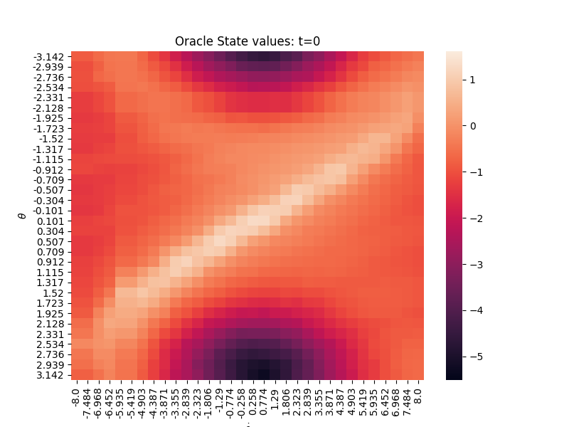
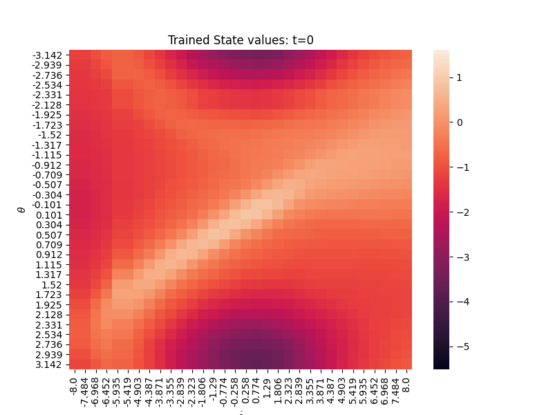

**Status:** `DebugRL` is deprecated. I'm working on [ShinRL](https://github.com/syuntoku14/debugRL/tree/shinrl) which supports regular gym environments such as Mujoco and Atari.

# DebugRL: A python library for debugging RL algorithms

[日本語](assets/README.jp.md) | English

`debug_rl` is a library for analyzing the behavior of reinforcement learning algorithms, including DeepRL.
This library is inspired by [diag_q](https://github.com/justinjfu/diagnosing_qlearning) (See [Diagnosing Bottlenecks in Deep Q-learning Algorithms](https://arxiv.org/abs/1902.10250)), but has been developed with an emphasis on ease of use.
Using matrix-form representation of the dynamics of environments, debug_rl allows you to calculate the oracle values such as action-value functions and stationary distributions that can only be approximated by multiple samples in the usual Gym environment.
To facilitate the addition and modification of new algorithms, implementations follows [OpenAI Spinningup](https://github.com/openai/spinningup)-style to minimize the dependencies between the algorithms.
See the notebook in [examples](examples) for basic usage.

The debug_rl is constructed of two parts: the `envs` and the `solvers`.
Although the `solvers` requires PyTorch, it is possible to install only `envs` for users who do not use PyTorch (See [Installation](#Installation)).

* `envs`:
  * All environments are subclasses of [TabularEnv](debug_rl/envs/base.py). They have step and reset functions similar to those of OpenAI Gym so that they can be used in the same way as the regular Gym environment.
  * Some of the environments support continuous action input and image-based observation modes that enable analysis of continuous action RL and CNN.
  * TabularEnv class has useful functions such as ``compute_expected_return`` to calculate true cumulative rewards and ``compute_action_values`` to calculate true action values (see [debug_rl/envs/base.py](debug_rl/envs/base.py) for details).
  * **All the environments returns done only at the end of the horizon.** Thus, the handling of done in solvers may be different from usual.
  * The following environments are supported:

|               Environment                |   Dicrete action   | Continuous action  | Image Observation  | Tuple Observation  |
| :--------------------------------------: | :----------------: | :----------------: | :----------------: | :----------------: |
|   [GridCraft](debug_rl/envs/gridcraft)   | :heavy_check_mark: |        :x:         |        :x:         | :heavy_check_mark: |
| [MountainCar](debug_rl/envs/mountaincar) | :heavy_check_mark: | :heavy_check_mark: | :heavy_check_mark: | :heavy_check_mark: |
|    [Pendulum](debug_rl/envs/pendulum)    | :heavy_check_mark: | :heavy_check_mark: | :heavy_check_mark: | :heavy_check_mark: |
|    [CartPole](debug_rl/envs/cartpole)    | :heavy_check_mark: | :heavy_check_mark: |        :x:         | :heavy_check_mark: |

* `solvers`:
  * A solver solves a **TabularEnv** by executing the `run` function.
  * You can continue learning by repeatedly calling `run` function. If you want to initialize the solver, call `initialize` function.
  * You can check the training progress by passing the logger of [clearML](https://github.com/allegroai/clearml) at the initialization. It is possible to run the solver without a logger.
  * Currently the following solvers are supported:

|                                      Solver                                      | Sample approximation | Function approximation | Continuous Action  |                                                  Algorithm                                                  |
| :------------------------------------------------------------------------------: | :------------------: | :--------------------: | :----------------: | :---------------------------------------------------------------------------------------------------------: |
|          [OracleViSolver, OracleCviSolver](debug_rl/solvers/oracle_vi)           |         :x:          |          :x:           |        :x:         |      Q-learning, [Conservative Value Iteration (CVI)](http://proceedings.mlr.press/v89/kozuno19a.html)      |
|     [ExactFittedViSolver, ExactFittedCviSolver](debug_rl/solvers/exact_fvi)      |         :x:          |   :heavy_check_mark:   |        :x:         |                                        Fitted Q-learning, Fitted CVI                                        |
|       [SamplingViSolver, SamplingCviSolver](debug_rl/solvers/sampling_vi)        |  :heavy_check_mark:  |          :x:           |        :x:         |                                               Q-learning, CVI                                               |
| [SamplingFittedViSolver, SamplingFittedCviSolver](debug_rl/solvers/sampling_fvi) |  :heavy_check_mark:  |   :heavy_check_mark:   |        :x:         | Fitted Q-learning ([DQN](https://storage.googleapis.com/deepmind-media/dqn/DQNNaturePaper.pdf)), Fitted CVI |
|                    [ExactPgSolver](debug_rl/solvers/exact_pg)                    |         :x:          |   :heavy_check_mark:   |        :x:         |                                               Policy gradient                                               |
|                 [SamplingPgSolver](debug_rl/solvers/sampling_pg)                 |         :x:          |   :heavy_check_mark:   |        :x:         |                                      Policy gradient (REINFORCE, A2C)                                       |
|                        [IpgSolver](debug_rl/solvers/ipg)                         |         :x:          |   :heavy_check_mark:   |        :x:         |                      [Interpolated policy gradient](https://arxiv.org/abs/1706.00387)                       |
|                        [SacSolver](debug_rl/solvers/sac)                         |  :heavy_check_mark:  |   :heavy_check_mark:   |        :x:         |                       [Discrete Soft Actor Critic](https://arxiv.org/abs/1910.07207)                        |
|              [SacContinuousSolver](debug_rl/solvers/sac_continuous)              |  :heavy_check_mark:  |   :heavy_check_mark:   | :heavy_check_mark: |                            [Soft Actor Critic](https://arxiv.org/abs/1801.01290)                            |
|                        [PpoSolver](debug_rl/solvers/ppo)                         |  :heavy_check_mark:  |   :heavy_check_mark:   |        :x:         |                 [Proximal Policy Optimization Algorithms](https://arxiv.org/abs/1707.06347)                 |

# Getting started

Here, we see a simple debugging example using debug_rl.
The described code can be executed by:

```bash
python examples/simple_debug.py
```

TabularEnv has several methods to compute oracle values.
Using those methods, you can analyze whether trained models actually solve the MDP or not.

* ```env.compute_action_values(policy)``` returns the oracle Q values from a policy matrix (numpy.array with `# of states`x`# of actions`).
* ```env.compute_visitation(policy, discount=1.0)``` returns the oracle normalized discounted stationary distribution from a policy matrix.
* ```env.compute_expected_return(policy)``` returns the oracle cumulative rewards from a policy matrix.

In this example, we train a SAC model in Pendulum environment, and check whether the model successfully learns the soft Q values using ```compute_action_values``` function.
Since Pendulum environment can plot only V values instead Q values, out goal is to plot trained soft V values.

We do debugging as follows:

1. Train a model. We use the SAC implementation from debug_rl in this example. You can use any models as long as it returns Q values or action probabilities from observations.
2. Using all_observations from TabularEnv, compute the policy matrix.
3. Compute soft Q values by env.compute_action_values. Since Pendulum environment supports only V values plotting, the following code plots V values instead. Check GridCraft environment if you want to see the behavior of Q values (see [examples/tutorial.ipynb](examples/tutorial.ipynb) for details).

```python
import torch
import numpy as np
import matplotlib.pyplot as plt
from scipy import special
from debug_rl.envs.pendulum import Pendulum, plot_pendulum_values, reshape_values
from debug_rl.solvers import SacSolver
device = "cuda" if torch.cuda.is_available() else "cpu"

# Step 1: train networks
env = Pendulum()
solver = SacSolver(env, solve_options={"device": device})
solver.run(num_steps=5000)
value_network = solver.value_network
policy_network = solver.policy_network

# Step 2: create policy matrix
tensor_all_obss = torch.tensor(
    env.all_observations, dtype=torch.float32, device=device)
preference = policy_network(tensor_all_obss).reshape(
    env.dS, env.dA).detach().cpu().numpy()  # dS x dA
policy = special.softmax(preference, axis=-1).astype(np.float64)
policy /= policy.sum(axis=-1, keepdims=True)  # dS x dA

# Step 3: plot soft Q values
oracle_Q = env.compute_action_values(
    policy, er_coef=solver.solve_options["er_coef"])  # dS x dA
trained_Q = value_network(tensor_all_obss).reshape(
    env.dS, env.dA).detach().cpu().numpy()  # dS x dA
V_max = max(oracle_Q.max(), trained_Q.max())
V_min = min(oracle_Q.min(), trained_Q.min())

oracle_V = np.sum(policy*oracle_Q, axis=-1)
oracle_V = reshape_values(env, oracle_V)  # angles x velocities
print("Press Q on the image to go next.")
plot_pendulum_values(env, oracle_V, vmin=V_min,
                     vmax=V_max, title="Oracle State values: t=0")
plt.show()

trained_V = np.sum(policy*trained_Q, axis=-1)
trained_V = reshape_values(env, trained_V)  # angles x velocities
plot_pendulum_values(env, trained_V, vmin=V_min,
                     vmax=V_max, title="Trained State values: t=0")
plt.show()
```

The code above will generate the following figures.
The upper figure shows the oracle soft V values, and the bottom figure shows the trained soft V values.




Since the oracle and the trained V values are quite similar, we can conclude that the network learns the soft Q values successfully.

# Installation

You can install both the debug_rl.envs and debug_rl.solvers by:

```bash
git clone git@github.com:syuntoku14/debugRL.git
cd debugRL
pip install -e .[solver]
```

If you want to use only the debug_rl.envs, install debug_rl by:

```bash
git clone git@github.com:syuntoku14/debugRL.git
cd debugRL
pip install -e .
```

# Citation

```
@misc{toshinori2020debugrl,
    author = {Kitamura Toshinori},
    title = {DebugRL},
    year = {2020},
    publisher = {GitHub},
    journal = {GitHub repository},
    howpublished = {\url{https://github.com/syuntoku14/debugRL}}
}
```
