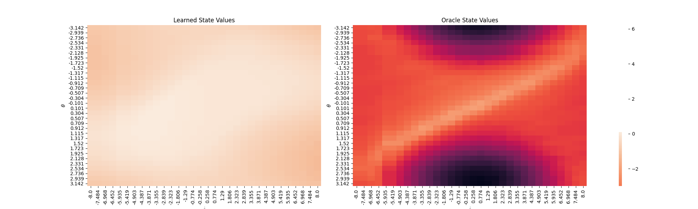

**Status:** Under development (expect bug fixes and huge updates)

# ShinRL: A python library for analyzing reinforcement learning

`ShinRL` is a reinforcement learning (RL) library with useful analysis tools.
It allows you to analyze the *shin* (*shin* means oracle in Japanese) behaviors of RL.

```python
import gym
from shinrl.solvers.sac.discrete import SacSolver

env = gym.make("TabularPendulum-v0")
solver = SacSolver(env)

# train SAC
solver.run(num_steps=500)

# plot learned state values
q_values = solver.tb_values
v_values = np.sum(solver.tb_policy*q_values, axis=-1)
env.plot_values(v_values, title="State Values")
```

See [quickstart.py](examples/quickstart.py) and [tutorial.ipynb](examples/tutorial.ipynb) for the basic usages.
For more information, you can refer to [ShinRL's documentation](https://shinrl.readthedocs.io/en/latest/?).





## Key features

### :zap: Oracle analysis with TabularEnv
* A flexible class `TabularEnv` provides useful functions for RL analysis. For example, you can calculate the oracle action-values with ``compute_action_values`` method.
* Subclasses of `TabularEnv` can be used as the regular OpenAI-Gym environments.
* Some environments support continuous action space and image observation.

#### Implemented environments

|                   Environment                    |   Dicrete action   | Continuous action  | Image Observation  | Tuple Observation  |
| :----------------------------------------------: | :----------------: | :----------------: | :----------------: | :----------------: |
|        [GridCraft](shinrl/envs/gridcraft)        | :heavy_check_mark: |        :x:         |        :x:         | :heavy_check_mark: |
| [TabularMountainCar-v0](shinrl/envs/mountaincar) | :heavy_check_mark: | :heavy_check_mark: | :heavy_check_mark: | :heavy_check_mark: |
|    [TabularPendulum-v0](shinrl/envs/pendulum)    | :heavy_check_mark: | :heavy_check_mark: | :heavy_check_mark: | :heavy_check_mark: |
|    [TabularCartPole-v0](shinrl/envs/cartpole)    | :heavy_check_mark: | :heavy_check_mark: |        :x:         | :heavy_check_mark: |

See [shinrl/\_\_init\_\_.py](shinrl/__init__.py) for the available environments.

### :fire: Gym solvers
* `ShinRL` provides algorithms to solve MDPs as `Solver`.
* Some solvers support the regular Gym environments as well as `TabularEnv`.
* The dependencies between solvers are minimized to facilitate the addition and modification of new algorithms.
* Easy to visualize the training progress with [ClearML](https://github.com/allegroai/clearml).

#### Implemented algorithms

|                                          Algorithms                                           |                 Discrete Control                  |                 Continuous Control                  |                                                                  Solvers                                                                  |
| :-------------------------------------------------------------------------------------------: | :-----------------------------------------------: | :-------------------------------------------------: | :---------------------------------------------------------------------------------------------------------------------------------------: |
| Value Iteration ([DQN](https://storage.googleapis.com/deepmind-media/dqn/DQNNaturePaper.pdf)) | [:heavy_check_mark:](shinrl/solvers/vi/discrete)  |                         :x:                         | <sup id="a1">[1](#f1)</sup>OracleViSolver<br>SamplingViSolver<br>ExactFittedViSolver<br><sup id="a1">[2](#f2)</sup>SamplingFittedViSolver |
|        [Conservative Value Iteration](http://proceedings.mlr.press/v89/kozuno19a.html)        | [:heavy_check_mark:](shinrl/solvers/vi/discrete)  |                         :x:                         |            OracleCviSolver<br>SamplingCviSolver<br>ExactFittedCviSolver<br><sup id="a1">[2](#f2)</sup>SamplingFittedCviSolver             |
|                               Policy Gradient (REINFORCE, A2C)                                | [:heavy_check_mark:](shinrl/solvers/pg/discrete)  |                         :x:                         |                                       ExactPgSolver<br><sup id="a1">[2](#f2)</sup>SamplingPgSolver                                        |
|               [Interpolated Policy Gradient](https://arxiv.org/abs/1706.00387)                | [:heavy_check_mark:](shinrl/solvers/ipg/discrete) |                         :x:                         |                                                   <sup id="a1">[2](#f2)</sup>IpgSolver                                                    |
|               [Proximal Policy Optimization](https://arxiv.org/abs/1707.06347)                | [:heavy_check_mark:](shinrl/solvers/ppo/discrete) | [:heavy_check_mark:](shinrl/solvers/ppo/continuous) |                                                   <sup id="a1">[2](#f2)</sup>PpoSolver                                                    |
|                      [Soft Actor-Critic](shinrl/solvers/sac_continuous)                       | [:heavy_check_mark:](shinrl/solvers/sac/discrete) | [:heavy_check_mark:](shinrl/solvers/sac/continuous) |                                                   <sup id="a1">[2](#f2)</sup>SacSolver                                                    |

<b id="f1">1</b> The naming rule follows [Diagnosing Bottlenecks in Deep Q-learning Algorithms](https://arxiv.org/abs/1902.10250): 
* *Oracle-* solvers don't contain any errors. 
* *Sampling-* solvers use data sampled from MDP.
* *Exact Fitted-* solvers use function approximation but don't use sampled data.
* *Sampling Fitted-* solvers use both function approximation and sampled data. 

<b id="f2">2</b> Those solvers support both TabularEnv and regular Gym environments.

# Installation

```bash
git clone git@github.com:syuntoku14/ShinRL.git
cd ShinRL
pip install -e .
```

# Citation

```
@misc{toshinori2020shinrl,
    author = {Kitamura Toshinori},
    title = {ShinRL},
    year = {2020},
    publisher = {GitHub},
    journal = {GitHub repository},
    howpublished = {\url{https://github.com/syuntoku14/ShinRL}}
}
```
