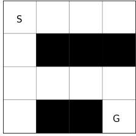
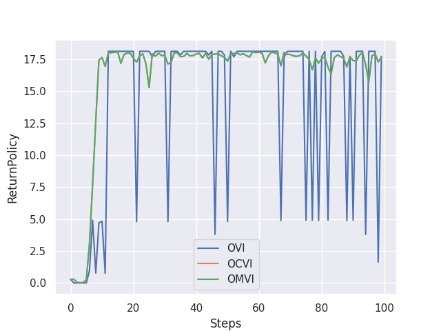
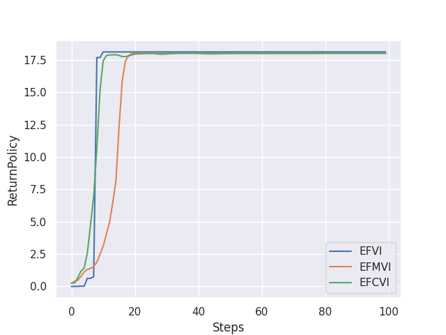
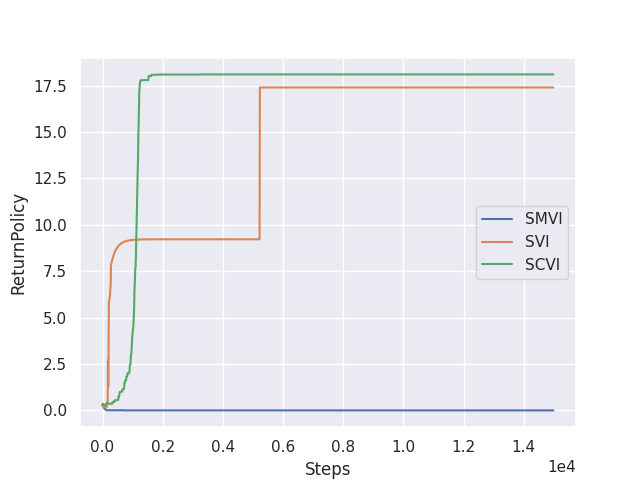
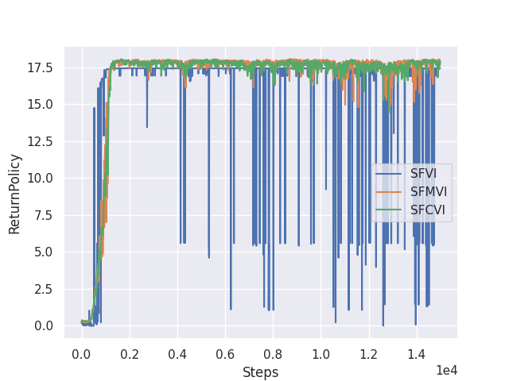

Benchmark Performance
=====================

Value Iteration Benchmark
------------------

Value Iteration (VI) is a special case of Policy Iteration (PI), which is a fundamental algorithm to find the optimal policy of a MDP. 
PI alternates the *policy improvement* step and the *policy evaluation* step. 
The improvement step updates the policy to the greedy policy :math:`\mathcal{G}(q)`, and the evaluation step updates :math:`q` using Bellman evaluation operator :math:`T_{\pi}`.
VI is the case when the policy improvement step does not contain any errors:

.. math::
    \begin{cases}
        \pi_{k+1} = \mathcal{G}(q_k) \\
        q_{k+1} = (T_{\pi_{k+1}})^m q_k + \epsilon_{k+1}
    \end{cases}

While VI can find the optimal policy, the plain VI scheme is known to be weak to errors.
Fortunately, recent studies have revealed that entropy and KL regularization improves error robustness of iterations [1]_.
Specifically, Conservative Value Iteration (CVI) [2]_ includes the both regularization and alternates as:

.. math::
    \begin{cases}
        \pi_{k+1} = \mathcal{G}^{\lambda, \tau}_{\pi_k}(q_k) \\
        q_{k+1} = (T^{\lambda, \tau}_{\pi_{k+1}|\pi_k})^m q_k + \epsilon_{k+1}
    \end{cases},

where :math:`\lambda` and :math:`\tau` are coefficients of KL and entropy regularization (See [1]_ for details).

.. [1] https://arxiv.org/abs/2003.14089
.. [2] http://proceedings.mlr.press/v89/kozuno19a.html

Mujoco Benchmark
------------------

.. image:: images/mujoco.png