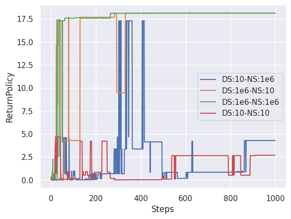

Deadly Triad
=====================

Goal
------------------

This experiment investigates the cause of deadly-triad.

Background
------------------

In reinforcement learning, *bootstrapping*, *off-policy learning*, and *function approximation* are known as deadly-triad, that together can lead to divergence in Q-learning algorithms.
Prior work [1]_ analyzes the deadly-triad based on a linear approximation to the deep Q learning.
Specifically, Q learning with off-policy learning and function approximation can be represented by the following update rule:

.. math::
    Q \leftarrow Q+\alpha K D_{\rho}\left(\mathcal{T}^{*} Q-Q\right)

where :math:`D_{\rho}` is a diagonal matrix representing sampling errors and :math:`K` is a constant symmetric positive-definite matrix representing function approximation errors.
Intuitively, we can avoid deadly-triad when :math:`D_{\rho}` and :math:`K` are under specific conditions:

* For the entries :math:`\rho(s, a)` of :math:`D_{\rho}`, :math:`\rho(s, a) > 0` for all :math:`(s, a)`  and :math:`\alpha \in (0, 1/\rho_{\max})`. This is the case when the agent explored enough.
* The diagonal elements of :math:`K` is much larger than non-diagonal ones. This is ensured when the function approximator is not overly generalized.

.. [1] https://arxiv.org/abs/1903.08894

This experiment examines the above discussion. 
We observe the performance of value iteration (VI) with different :math:`D_\rho` and :math:`K`.

Results
------------------

The figure illustrates the performance of VI with two hyperparameters: *DS* represents how large the diagonal elements of :math:`K` w.r.t. non-diagonal ones, and *NS* represents how dense the diagonal elements of :math:`D_{\rho}`.
In other words, the smaller DS and NS, the closer VI is to deadly-triad.
As you can see, smaller DS and NS fail to converge to the optimal policy, which is consistent to the theory.

Reproduction
------------------

Expected time: 5 minutes

.. code-block:: bash

    experiments/DeadlyTriad/run.bash
