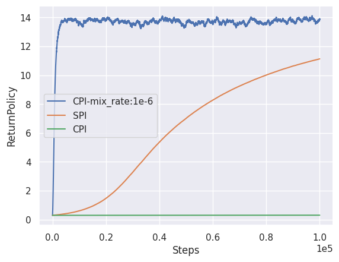

Monotonic Policy Improvement
=====================

Goal
------------------

This experiment evaluates several monotonic improvement algorithms.

Background
------------------

Monotonic improvement is an essential property of reinforcement learning (RL), which guarantees that the current policy has better performance than the previous ones. 
Conservative Policy Iteration (CPI) [1]_ and its derivative, Safe Policy Iteration (SPI) [2]_ , are classical approaches to obtain monotonicity.
These algorithms linearly mix the current policy and a greedy policy :math:`\mathcal{G}(q)` to trade-off the convergence speed and the conservativeness.

.. math::
    \begin{cases}
    \pi_{k+1}=\left(1-\zeta\right) \pi_{k}+\zeta \mathcal{G}\left(q_{k}\right) \\
    q_{k+1}=\left(T_{\pi_{k+1}}\right)^{m} q_{k}+\epsilon_{k+1}
    \end{cases},

By adjusting the mixing coefficient :math:`\zeta`, you can always ensure that :math:`\pi_{k+1}` is better than :math:`\pi_k`.
This experiment evaluates how each algorithms trade-off the convergence speed and the conservativeness.

.. [1] http://citeseerx.ist.psu.edu/viewdoc/summary?doi=10.1.1.7.7601
.. [2] http://proceedings.mlr.press/v28/pirotta13.html

Results
------------------

To evaluate the monotonicity, we add Gaussian noise to the value matrix every update.

As the figure shows, CPI and SPI demonstrate monotonic improvement while constant :math:`\zeta` demonstrates an oscillated curve. CPI and SPI show degradation about :math:`-10^{-6}`, which may be due to numerical errors.

While algorithms with monotonicity obtain smooth curves, their convergence rate is much slower than constant :math:`\zeta`.
This is an expected result because the smaller :math:`\zeta`, the slower convergence rate [3]_ .

.. [3] https://arxiv.org/abs/1906.09784

Reproduction
------------------

Expected time: 20 minutes

.. code-block:: bash

    experiments/MonotonicPolicyImprovement/run.bash
