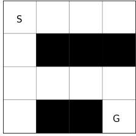

VI Performance Bound
=====================

Goal
------------------

This experiment aims to observe the effect of entropy and KL regularization in value iteration scheme.

Background
------------------

Value Iteration (VI) is a special case of Policy Iteration (PI), which is a fundamental algorithm to find the optimal policy of a MDP. 
PI alternates the *policy improvement* step and the *policy evaluation* step. 
The improvement step updates the policy to the greedy policy :math:`\mathcal{G}(q)`, and the evaluation step updates :math:`q` using Bellman evaluation operator :math:`T_{\pi}`.
VI is the case when the policy improvement step does not contain any errors:

.. math::
    \begin{cases}
        \pi_{k+1} = \mathcal{G}(q_k) \\
        q_{k+1} = (T_{\pi_{k+1}})^m q_k + \epsilon_{k+1}
    \end{cases}

While VI can find the optimal policy, the plain VI scheme is known to be weak to errors.
Fortunately, recent studies have revealed that adding entropy and KL regularization improves robustness to errors [1]_.
Specifically, Conservative Value Iteration (CVI) [2]_ includes the both regularization and alternates as:

.. math::
    \begin{cases}
        \pi_{k+1} = \mathcal{G}^{\lambda, \tau}_{\pi_k}(q_k) \\
        q_{k+1} = (T^{\lambda, \tau}_{\pi_{k+1}|\pi_k})^m q_k + \epsilon_{k+1}
    \end{cases},
    :label: ref:cvi

where :math:`\lambda` and :math:`\tau` are coefficients of KL and entropy regularization (See [1]_ for details).

Let's compare the performance bounds of the plain VI and CVI (without entropy regularization for ease of discussion).

.. math::
    \begin{align}
        \text{VI}:& \; \left\|q_{*}-q_{\pi_{k}}\right\|_{\infty} \leq \frac{2 \gamma}{(1-\gamma)^{2}}\left((1-\gamma) \sum_{j=1}^{k} \gamma^{k-j}\left\|\epsilon_{j}\right\|_{\infty}\right)+\frac{2}{1-\gamma} \gamma^{k} v_{\max } \\
        \text{CVI} (\tau=0): & \; \left\|q_{*}-q_{\pi_{k}}\right\|_{\infty} \leq \frac{2}{1-\gamma}\left\|\frac{1}{k} \sum_{j=1}^{k} \epsilon_{j}\right\|_{\infty}+\frac{4}{1-\gamma} \frac{v_{\max }^{\lambda}}{k},
    \end{align}

where :math:`v_{\max }^{\tau}=\frac{r_{\max }+\tau \ln |\mathcal{A}|}{1-\gamma}` is the maximum state value.
Intuitively, for each bound, the first term represents the error tolerance and the second term represents the convergence speed.
As for the error tolerance, while VI has a *sum of the norms* of the errors and a *quadratic* time horizon dependency, CVI has a *norm of the average* of the errors and a *linear* time horizon dependency.
This indicates that the errors in CVI have a smaller effect on the final performance than VI.
On the other hand, the convergence rate of CVI is exponentially slower than that of VI.
This slower convergence is expected since CVI includes KL regularization which penalizes policy to change aggressively.

.. [1] https://arxiv.org/abs/2003.14089
.. [2] http://proceedings.mlr.press/v89/kozuno19a.html

This experiment aims to validate the performance bounds of VI and CVI using the following simple maze environment.

Results
------------------

To see the error tolerance, we add Gaussian noise to the value matrix every update.

.. image:: Performance.png

The figure illustrates that adding KL regularization leads to better error tolerance.
However, we cannot see any advantage of entropy regularization from this experiment.

Reproduction
------------------

Expected time: 10 seconds

.. code-block:: bash

    experiments/VIPerformanceBound/run.bash
