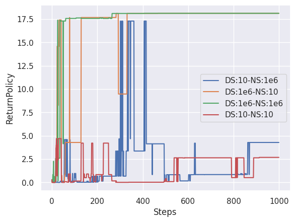

# Experiment: Deadly Triad

For more discussion, see: 
https://shinrl.readthedocs.io/en/latest/experiments/DeadlyTriad/experiment.html

## Goal 

This experiment investigates the cause of deadly triad based on https://arxiv.org/abs/1903.08894.

## Results

Value Iteration:



Conservative Value Iteration:


## Reproduction 

```bash
experiments/DeadlyTriad/run.bash
```