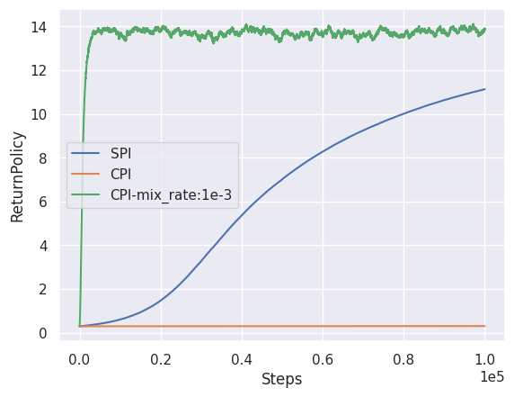

# Experiment: Monotonic Policy Improvement


Monotonic improvement is an essential property of reinforcement learning (RL), which guarantees that the current policy has better performance than the previous ones. 
Conservative Policy Iteration (CPI) and its derivative, Safe Policy Iteration (SPI), are classical approaches to obtain monotonicity.
These algorithms linearly mix the current policy and a greedy policy to trade-off the convergence speed and the conservativeness.
This experiment aims to observe the trade-off using a simple tabular MDP without exploration.
Similar to the ``VIPerformanceBound experiment``, we add Gaussian noise to the value matrix every update.



<br/>

|                    |    CPI    |  SPI  | CPI(mixing rate=1e-6) |
| :----------------: | :-------: | :---: | :-------------------: |
| Policy degradation | -3 x 1e-7 |  0.0  |       -2 x 1e-6       |

<br/>

The figure and the table show that the mixing rate design of SPI is more efficient than CPI while demonstrating the monotonic improvement.
Notably, CPI and CPI with constant mixing rate fail to obtain monotonicity even the smaller mixing rate.
The reason why CPI lacks the monotonicity may be due to the poor implementation.

You can reproduce the results by:
```bash
experiments/MonotonicPolicyImprovement/run.bash
```