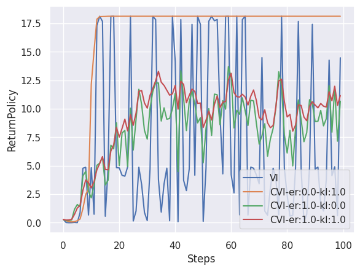

# Experiment: Performance Bound of VI

For more discussion, see: 
https://shinrl.readthedocs.io/en/latest/experiments.html

## Goal 

This experiment aims to observe the effect of entropy and KL regularization in value iteration scheme.

## Results



## Reproduction 

```bash
experiments/VIPerformanceBound/run.bash
```