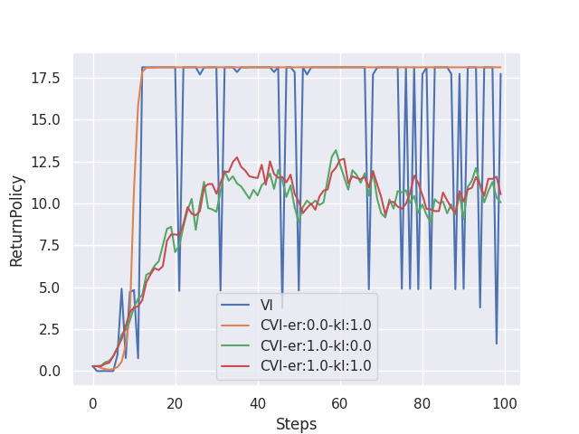

# Experiment: Performance Bound of VI

Value Iteration (VI) is a special case of Policy Iteration (PI), a fundamental algorithm to find the optimal policy of an MDP. 
Some studies described that adding entropy and KL regularization brings various benefits to the VI scheme, e.g., improving error tolerance.
This experiment aim to observe the effect of regularization.

We demonstrate CVI and VI in a simple tabular MDP without exploration.
To see the error tolerance, we add Gaussian noise to the value matrix every update.



The figure illustrates that adding KL regularization leads to better error tolerance.
However, we cannot see any advantage of entropy regularization from this experiment.

You can reproduce the results by:
```bash
experiments/VI_Performance_Bound/run_VI.bash
```